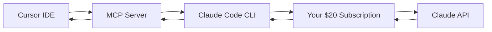

# Claude Code MCP for Cursor

Use your existing Claude subscription ($20/month) with Cursor IDE instead of paying separate API costs.

## 🎯 What This Does

This MCP (Model Context Protocol) server bridges **Claude Code CLI** with **Cursor IDE**, allowing you to:

- ✅ Use your existing **$20/month Claude subscription** in Cursor
- ✅ Avoid separate **pay-per-use API billing**
- ✅ Keep your Claude usage within your monthly plan limits
- ✅ Get the same Claude experience directly in your IDE

## 💰 Cost Benefits

| Method | Cost Structure | Monthly Estimate* |
|--------|---------------|-------------------|
| **This MCP Bridge** | $20/month (your existing plan) | **$20** |
| **Direct API** | Pay-per-token usage | $30-100+ |

*Estimates vary based on usage patterns

## 🔧 Prerequisites

1. **Claude Code CLI** installed and authenticated
   ```bash
   # Install Claude Code (if not already installed)
   curl -fsSL https://claude.ai/install.sh | bash
   
   # Verify it works
   claude chat "Hello"
   ```

2. **Cursor IDE** with MCP support
3. **Node.js** installed on your system

## 📦 Installation

### Step 1: Clone this repository

```bash
git clone https://github.com/Blackpenguin46/Claude-Code-MCP-for-Cursor.git
cd Claude-Code-MCP-for-Cursor
```

### Step 2: Set up the MCP server in your project

Copy the files to your project directory:

```bash
# Copy the MCP server to your project root
cp claude-mcp-server.js /path/to/your/project/

# Create the .cursor directory if it doesn't exist
mkdir -p /path/to/your/project/.cursor

# Copy the MCP configuration
cp mcp.json /path/to/your/project/.cursor/
```

Your project structure should look like:
```
your-project/
├── .cursor/
│   └── mcp.json
├── claude-mcp-server.js
└── (your other project files)
```

### Step 3: Configure Cursor

1. Open Cursor
2. Go to **Settings** → **Tools & Integrations** → **MCP Tools**
3. You should see "claude-code" in the MCP Tools section
4. Make sure the toggle is **enabled** (green)
5. Verify it shows "**1 tools enabled**" (not "0 tools enabled")

If you see "0 tools enabled":
- Restart Cursor completely
- Check that files are in the correct locations
- Ensure `claude-mcp-server.js` is executable: `chmod +x claude-mcp-server.js`

## 🧪 Testing

Test that everything works:

1. **Test Claude Code directly:**
   ```bash
   claude chat "What is 2+2?"
   ```

2. **Test the MCP server:**
   ```bash
   cd your-project
   node claude-mcp-server.js
   ```
   
   Then paste this JSON and press Enter:
   ```json
   {"jsonrpc":"2.0","id":3,"method":"tools/call","params":{"name":"claude_chat","arguments":{"message":"What is 2+2?"}}}
   ```
   
   You should see a response like:
   ```json
   {"jsonrpc":"2.0","id":3,"result":{"content":[{"type":"text","text":"4"}]}}
   ```

3. **Test in Cursor:**
   - Open a chat in Cursor
   - Ask Claude a question
   - Verify the response comes from your Claude Code subscription

## 🔍 How It Works



1. **Cursor** sends chat requests to the MCP server
2. **MCP Server** translates requests to Claude Code CLI commands
3. **Claude Code** uses your existing subscription to contact Claude
4. **Response** flows back through the chain to Cursor

## 📁 File Descriptions

### `claude-mcp-server.js`
The main MCP server that bridges Cursor and Claude Code. Handles:
- JSON-RPC protocol for MCP communication
- Spawning Claude Code processes
- Response cleaning and formatting
- Error handling and timeouts

### `.cursor/mcp.json`
Cursor's MCP configuration file that tells Cursor how to connect to the server:
```json
{
  "mcpServers": {
    "claude-code": {
      "command": "node",
      "args": ["claude-mcp-server.js"],
      "env": {}
    }
  }
}
```

## 🚨 Troubleshooting

### "0 tools enabled" in Cursor
- Ensure files are in correct locations
- Restart Cursor completely
- Check file permissions: `chmod +x claude-mcp-server.js`
- Verify Claude Code works: `claude chat "test"`

### MCP server hangs or errors
- Test Claude Code independently first
- Check that you're authenticated with Claude Code
- Verify Node.js is installed and working
- Look at Cursor's developer console for errors

### "Claude Code error" messages
- Ensure Claude Code is properly installed and authenticated
- Check your Claude subscription status
- Verify you haven't exceeded usage limits

## 🔄 Usage Patterns

### Best Practices
- **Development work**: Perfect for code review, debugging, refactoring
- **Documentation**: Great for generating comments and documentation
- **Learning**: Ideal for understanding new codebases or technologies

### What Counts Against Your Limits
- Each message sent through Cursor counts against your $20/month plan limits
- Same usage tracking as using Claude Code directly in terminal
- Monitor your usage in Claude's web interface

## 🎁 Benefits Over Direct API

| Feature | MCP Bridge | Direct API |
|---------|------------|------------|
| **Cost Predictability** | ✅ Fixed $20/month | ❌ Variable usage costs |
| **Usage Limits** | ✅ Clear monthly limits | ❌ Surprise bills possible |
| **Setup Complexity** | ⚠️ Initial setup required | ✅ Simple API key |
| **Claude Code Integration** | ✅ Uses existing auth | ❌ Separate billing |

## 🤝 Contributing

1. Fork the repository
2. Create a feature branch
3. Make your changes
4. Test thoroughly
5. Submit a pull request

## 📄 License

MIT License - feel free to use and modify as needed.

## ⚡ Quick Start Summary

```bash
# 1. Clone repo
git clone https://github.com/Blackpenguin46/Claude-Code-MCP-for-Cursor.git

# 2. Copy files to your project
cp claude-mcp-server.js /path/to/project/
mkdir -p /path/to/project/.cursor
cp mcp.json /path/to/project/.cursor/

# 3. Test
claude chat "Hello"  # Verify Claude Code works
node claude-mcp-server.js  # Test MCP server

# 4. Restart Cursor and check MCP Tools section
```

---

**💡 Pro Tip**: This setup is perfect for developers who use Claude regularly for coding tasks and want predictable monthly costs instead of surprise API bills!